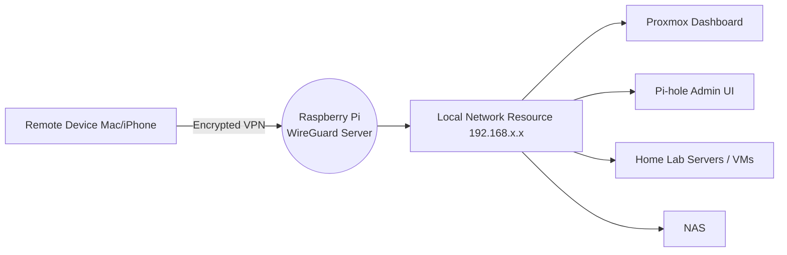

# Secure-Wireguard-VPN-Writeup
A secure WireGuard VPN deployment enabling encrypted remote access to home lab services.

## Overview

This project sets up **WireGuard VPN** on a Raspberry Pi to enable secure remote access to home network resources such as:

- Proxmox dashboard
- Pi-hole admin UI
- Home lab servers / VMs
- Private internal services

WireGuard is a modern VPN protocol with:

- High performance (kernel-mode networking)
- Minimal attack surface
- Cryptographic key authentication only

---

## Installation (PiVPN)

Run installer:

```bash
curl -L https://install.pivpn.io | bash
```

Recommended setup choices during installer config

| Option | Value |
| --- | --- |
| VPN | WireGuard |
| DNS | Pi-hole or Cloudflare |
| Port | 51820/UDP |
| IPv6 Routing | Yes |
| Public IP | Use detected |
- Will prompt you to reboot following the config selection

---

## Post-Install Configuration

### Create a new VPN profile

This will prompt you to add a device profile with the name you want to assign it

```bash
pivpn add
```

To display QR code for mobile device:

```bash
pivpn -qr
```

Profiles are stored at:

```
/home/<user>/configs/*.conf
```

---

## Router Configuration

### Port Forwarding Rule

| Setting | Value |
| --- | --- |
| Protocol | UDP |
| External Port → Internal Port | 51820 → 51820 |
| Destination IP | Static IP of the Pi or server hosting wireguard |

## Network Flow Diagram



## Current Security Posture

| Feature | Status |
| --- | --- |
| Mutual key authentication only | ✅ |
| Minimal attack surface (1 UDP port) | ✅ |
| Kernel-mode crypto | ✅ |
| DNS privacy via Pi-hole + Unbound | ✅ |
| Automated security updates | ✅ |

---

## Useful WireGuard Monitoring Commands
```bash
#WireGuard status
sudo wg show

#Live bandwidth + handshake monitor
watch -n 1 sudo wg show

#Restart WireGuard interface
sudo systemctl restart wg-quick@wg0

#Check systemd service status
sudo systemctl status wg-quick@wg0

#Check interface network stats
ip -s link show wg0

#Log events (connect/disconnect)
sudo journalctl -u wg-quick@wg0 -f
```
